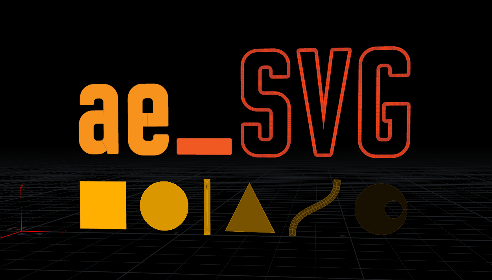

# ae_SVG
Python-based assets for importing and exporting SVG files in Houdini



# Installation
The importer uses the svg.path library - https://pypi.python.org/pypi/svg.path
To ensure Houdini has access to this library:
- Install Python2.7
- Install pip, the python package manager - https://bootstrap.pypa.io/get-pip.py
- Run 'pip install svg.path' which will install svg.path into Python27\Lib\site-packages
- **Create an empty \_\_init\_\_.py file inside the svg/ directory of the svg/path installation**
- ~~In your houdini.env file, append the site-packages directory to the python search path, e.g `PYTHONPATH = &;C:\Python27\Lib\site-packages`~~
- Setting PYTHONPATH in the houdini.env file apparently breaks some python modules that come with Houdini. The workaround is to add
```import sys
sys.append("C:\Python27\Lib\site-packages")```
to the startup scripts (123 and 456.py) or just type these lines into the python shell when you need the SVG Loader. I'm aiming to find a better solution

# Importer
A digital asset which can load SVG files into SOPs.
Features:
- Supports Line, Polyline, Polygon, Circle, Rect and Path elements (Cubic bezier paths - open or closed)
- Supports Compound shapes
- Loads Fill, Stroke, Stroke-Weight and Opacity data and stores these as Primitive attributes
- Options for outlining strokes, hole-ing compound shapes and converting bezier curves to polygons

Current Limitations:
- Does not support clipping paths (Produces Error)
- Does not support group tags <g>

# Exporter
A digital asset which can save the contents of a Houdini scene to SVG format
- A work-in-progress which is currently limited to polygons and polylines. Usable but not guaranteed stable.
- 2 digital assets: SVG_Export and SVG_ProcessAndExport. The latter performs geometry cleanup, camera projection and culling before as well as exports. 
